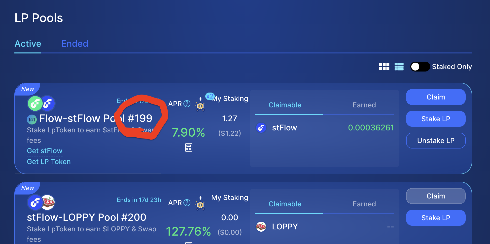

## 👋 Welcome to the Flow Actions Scaffold

This repository is a scaffold for building with Flow Actions and includes AI-friendly guidance for composing safe Cadence transactions from standardized connectors.

- **What's included**:
  - Minimal Flow project with dependencies for Flow Actions and IncrementFi connectors
  - Example transaction: Claim → Zap → Restake for IncrementFi LP rewards
  - Cursor rules context for Flow Actions; helpful for agent-assisted development ([Cursor Rules](https://docs.cursor.com/en/context/rules))

References:
- FLIP-338: Flow Actions – composable standards for protocols ([FLIP PR #339](https://github.com/onflow/flips/pull/339))
- FlowActions repo: [onflow/FlowActions](https://github.com/onflow/FlowActions)

## 🔨 Prerequisites

- Flow CLI: install from the [Flow CLI docs](https://developers.flow.com/tools/flow-cli/install)
- Cursor + Cadence extension (recommended): [Cadence Extension](https://marketplace.visualstudio.com/items?itemName=onflow.cadence)

## ⚡ Quick Commands (Makefile)

```bash
make start      # Start emulator with full Increment Fi environment
make emulator   # Alias for 'make start' 
make deploy     # Deploy contracts to network (NETWORK=emulator|testnet|mainnet)
make test       # Run Cadence tests

# Example: Check rewards after setup
flow scripts execute cadence/scripts/get_available_rewards.cdc --network emulator \
  --args-json '[{"type":"Address","value":"0xf8d6e0586b0a20c7"},{"type":"UInt64","value":"0"}]'
```

## 📦 Project Structure

```
flow-actions-scaffold/
├── flow.json                              # Project configuration with FlowActions/IncrementFi dependencies
├── README.md                              # This file
└── cadence/
    ├── contracts/                         # 🔌 Connector Contracts
    │   └── ExampleConnectors.cdc          # Example TokenSink connector implementation
    ├── scripts/                           # 📖 Read-Only Scripts
    │   └── get_available_rewards.cdc      # Query claimable rewards from IncrementFi pools
    ├── transactions/                      # 💸 Transaction Templates
    │   └── increment_fi_restake.cdc       # Claim + Zap + Restake IncrementFi rewards
    └── tests/                             # 🧪 Test Files
        └── (test files as needed)
```

### 🔌 **Available Connectors**
- **`ExampleConnectors.TokenSink`** - Simple sink that deposits tokens into a vault capability
  - Demonstrates DeFiActions.Sink interface implementation
  - Type-safe deposits with precondition checks
  - UniqueIdentifier support for operation tracing

### 📖 **Available Scripts**
- **`get_available_rewards.cdc`** - Query claimable rewards from IncrementFi staking pools
  - **Inputs**: `staker: Address, pid: UInt64`
  - **Output**: `UFix64` - Amount of rewards available to claim
  - Uses `PoolRewardsSource.minimumAvailable()` for accurate reward calculation

### 💸 **Available Transactions**
- **`increment_fi_restake.cdc`** - Complete restaking workflow for IncrementFi pools
  - **Input**: `pid: UInt64` - Pool ID to restake rewards for
  - **Flow**: Claim rewards → Zap to LP tokens → Restake into same pool
  - **Safety**: Pre/post conditions, residual assertions, capacity-based withdrawals
  - **Components**: Uses `PoolRewardsSource`, `Zapper`, `SwapSource`, and `PoolSink`

## ⚙️ Setup & Account Configuration

### 1. Install Dependencies (Required for All Networks)

Install all declared dependencies from `flow.json` right after cloning locally:
```bash
git clone <REPO_URL>
cd flow-actions-scaffold
flow deps install
```
See the Flow CLI Dependency Manager docs for details: [Dependency Manager](https://developers.flow.com/tools/flow-cli/dependency-manager).

### 2. Account Setup by Network

#### **Emulator (Local Development)**
The `make start` command handles all setup automatically using the built-in emulator service account, so no manual configuration is needed.

#### **Testnet**
1. Create an account:
   ```bash
   flow accounts create --network testnet
   ```
   This automatically updates your `flow.json` with the new account details.

2. Fund it via the Testnet Faucet: [testnet-faucet.onflow.org](https://testnet-faucet.onflow.org)

3. Create your `Staking.UserCertificate`: https://run.dnz.dev/snippet/12d94bff356ed607

#### **Mainnet**
1. **⚠️ Warning**: Transactions on mainnet incur fees and affect on-chain balances. Consider creating a new Flow Wallet account with limited funds.

2. Create or configure your account:
   - **Option A**: Create new account: `flow accounts create --network mainnet`
   - **Option B**: Use existing account from Flow Wallet Extension ([Export private key guide](https://docs.wallet.flow.com/tutorial/extension-private-key-and-seed-phrase-guide))

3. Ensure sufficient FLOW for fees and storage

4. Create your `Staking.UserCertificate`: https://run.dnz.dev/snippet/d1bf715483551879

5. **Set up IncrementFi position**: Go to `https://app.increment.fi` and stake tokens so you have an active position to restake rewards from.

#### **Manual flow.json Configuration (if needed)**
If you prefer manual configuration, add accounts to the `accounts` section in `flow.json`:
```json
{
  "accounts": {
    "my-testnet-account": {
      "address": "0x1234567890abcdef", 
      "key": { "type": "file", "location": "my-testnet-account.pkey" }
    },
    "my-mainnet-account": {
      "address": "0xabcdef1234567890",
      "key": { "type": "file", "location": "my-mainnet-account.pkey" }
    }
  }
}
```
Make sure your private key files (`.pkey`) are in the project root and match the `location` specified.

### 3. Find Your Pool ID (Testnet/Mainnet)
- Go to the IncrementFi Farms page: https://app.increment.fi/farm
- Locate your pool and read the number in the pool name (formatted like `#198`). That number is the `pid` used by scripts and transactions.



## 🚀 Getting Started by Network

### **Emulator (Recommended for Testing)**

**🚀 Automated Setup (Recommended)**

1. **Start the complete Increment Fi environment**:
   ```bash
   make start
   ```
   This automatically:
   - Starts the Flow emulator and deploys Increment Fi dependencies
   - Creates test tokens: **TokenA** and **TokenB** (1M each)
   - Sets up liquidity pool: **TokenA-TokenB** pair (100k each token)
   - Creates staking pool #0 with 50k pre-staked LP tokens
   - Displays environment summary

2. **Test the restake workflow**:
   ```bash
   # Check available rewards
   flow scripts execute cadence/scripts/get_available_rewards.cdc \
     --network emulator \
     --args-json '[{"type":"Address","value":"0xf8d6e0586b0a20c7"},{"type":"UInt64","value":"0"}]'

   # Run the restake transaction
   flow transactions send cadence/transactions/increment_fi_restake.cdc \
     --signer emulator-account \
     --network emulator \
     --args-json '[{"type":"UInt64","value":"0"}]'

   # Verify rewards were claimed and restaked
   flow scripts execute cadence/scripts/get_available_rewards.cdc \
     --network emulator \
     --args-json '[{"type":"Address","value":"0xf8d6e0586b0a20c7"},{"type":"UInt64","value":"0"}]'
   ```

**Why Pool ID `0`?** The automated setup creates the first staking pool with ID `0` containing your staked LP tokens and active rewards.

### **Testnet/Mainnet**

After completing account setup above, run the transaction:

```bash
# Testnet
flow transactions send cadence/transactions/increment_fi_restake.cdc \
  --network testnet \
  --signer testnet-account \
  --args-json '[{"type":"UInt64","value":"<YOUR_POOL_PID>"}]'

# Mainnet  
flow transactions send cadence/transactions/increment_fi_restake.cdc \
  --network mainnet \
  --signer mainnet-account \
  --args-json '[{"type":"UInt64","value":"<YOUR_POOL_PID>"}]'
```

Replace `<YOUR_POOL_PID>` with your actual pool ID from the IncrementFi Farms page.

## 🔧 Deployment Notes

- **Emulator**: Contracts are deployed locally when you run `flow project deploy --network emulator`
- **Testnet/Mainnet**: Connectors are already deployed and referenced via `dependencies.aliases` in `flow.json`

## 🧭 Flow Actions Composition (Quick Reference)

Minimal restake flow connectors used in `cadence/transactions/increment_fi_restake.cdc`: 
- Source: `IncrementFiStakingConnectors.PoolRewardsSource`
- Swapper: `IncrementFiPoolLiquidityConnectors.Zapper` (token types and `stableMode` from pair)
- SwapSource: `SwapConnectors.SwapSource(swapper, source)`
- Sink: `IncrementFiStakingConnectors.PoolSink`

String-based imports are used throughout. Safety invariants: size withdraws by sink capacity, assert residuals, single-expression pre/post.

## 💬 Example AI Prompts
- "Create me a Cadence transaction which restakes my Increment Fi LP token staking rewards"
- "Generate a minimal restake transaction using Flow Actions connectors (PoolRewardsSource → Zapper via SwapSource → PoolSink) with string imports and safety invariants"
- "Compose a SwapSource from PoolRewardsSource and IncrementFiPoolLiquidityConnectors.Zapper, then stake to IncrementFiStakingConnectors.PoolSink with pre/post checks and residual assertion"
- "Add a post condition verifying the stake increased by the expected zapper.quoteOut amount"

## 🧪 Testing

Run Cadence tests:
```bash
make test
# or directly:
flow test
```

## 🔗 Helpful Links

- Flow Docs: [developers.flow.com](https://developers.flow.com)
- Cadence Language: [cadence-lang.org/docs/language](https://cadence-lang.org/docs/language)
- Block Explorers: [Flowscan](https://flowscan.io/)

## 🤝 Community
- Forum: [forum.flow.com](https://forum.flow.com/)
- Discord: [discord.gg/flow](https://discord.gg/flow)
- Telegram: [Flow Blockchain - Official](https://t.me/flow_blockchain)
- X: [@flow_blockchain](https://x.com/flow_blockchain)
